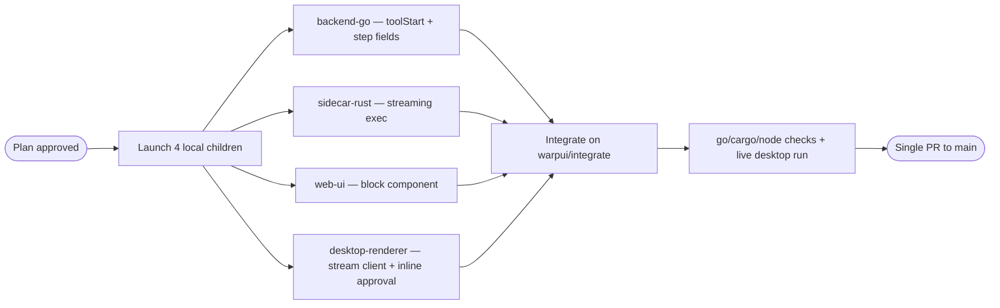

# Warp-style command blocks and agent output
## Problem
When the agent runs a command, the UI shows a one-line accordion row that appears only *after* the tool finishes, labelled with a canned preview ("Running a command — command completed"). The real command output, its exit code, and any live progress are never shown. Warp's block model — command grouped with its output, live streaming, exit status, collapsible detail — is what's missing.
## How Warp presents it
A command and its output are grouped into one colour-coded block; a non-zero exit turns the block red. Long output keeps a sticky command header and a scroll-lock/"jump to bottom" affordance while it streams. Agent work streams into an AI block: narration/answer as markdown, a requested command shown with an explicit approve step, and the executed command's output expandable to see details; a failed command is detected and the agent self-corrects.
## Current state
An agent turn renders as: thinking accordion → steps drawer → search evidence → answer bubble → meta row (`www/app.js:1446`). Each trace row is a collapsed `
` built by `buildStepRow` in `www/lib.js (290-349)`; finalized turns hide the trace behind a tool-badge popup (`www/app.js:1567`).
The row is emitted only after execution: `emitTool(agentStep{…DurationMs})` at `backend/agent.go:723`. The single pre-execution signal is `emitPhase("tool:"+name)` (`backend/agent.go:687`), which drives a generic "Using X…" status (`www/lib.js (599-604)`). There is no "tool started" event carrying the command.
Command output never reaches the UI. `exec_run_command` (`desktop/src-tauri/src/github.rs:1739`) runs `sh -c` via `.output()` — fully buffered — and returns `observation` (capped 4000 chars, model-bound) plus `preview` = `"command completed"` / `"exit N"`. The renderer posts only observation/preview/isError to `/tool-response` (`backend/handlers.go:997`), so the exit code and output text are dropped before they can be displayed.
Approval is a modal overlay owned by the desktop renderer, FIFO-queued across concurrent chats, with a decent unified-diff renderer that exists nowhere else (`desktop/renderer/desktop.js (423-553)`).
Delivery: the desktop app serves the same `www/` and injects `renderer/desktop.js` + `desktop.css` (`desktop/src-tauri/src/sidecar.rs (308-331)`), and the two halves already talk over `nasllm:*` CustomEvents. So UI work in `www/` lands in both the web chat and the desktop app; command execution is desktop-only (`toolExec` is handled exclusively by the renderer shim — `www/app.js` has no listener).
Persistence is cheap: the trace rides in the conversation's messages JSON blob (`Message.Steps`, `backend/store.go:35`), so new `agentStep` fields with `omitempty` round-trip old rows untouched. Only the analytics table `agent_steps` has fixed columns, and `migrate()` (`backend/store.go:240`) is the established place to add them.
## Proposed changes
### 1. Block component (`www/lib.js`, `www/styles.css`)
A `toolBlock` component replacing the flat row for command-shaped tools (`run_command`, `apply_patch`, `git_commit`, `git_push`, `create_pr`): header = icon + human label + the command/target in `var(--mono)` + a status chip (spinner while running, `exit 0` + duration when done, `exit N` when not); body = output `<pre>` in a bounded, scroll-locked container; footer = copy command / copy output / expand. Left rail and border colour-coded with the existing `--accent` / `--ok` / `--bad` tokens; success collapses on completion, failure stays open. A `position: sticky` header inside the scroll container gives Warp's sticky command header.
Read-only tools (`read_file`, `grep`, `glob`, `list_files`, `git_status`) keep today's compact row so a run doesn't become a wall of blocks. Blocks render inline for finalized turns too, instead of being hidden in the tool-badge popup.
### 2. Live block lifecycle (`backend/agent.go`, `backend/jobs.go`, `backend/handlers.go`, `www/app.js`)
Add a `toolStart` SSE event emitted immediately before execution (`agent.go` ~706) carrying `{step, tool, args}`, broadcast via a `broadcastControl`-style emit and stashed for replay on (re)connect next to the existing `steps`/`thoughts` replay in `handlers.go (595-620)` — mirroring how `pendingToolExec` is snapshotted.
`tailJob` (`www/app.js:1296`) gains a `toolStart` handler that opens a block keyed `jobId:step`, and the existing `tool` handler closes the matching block with duration/preview/isError instead of appending a new row. This alone makes the running command visible, for server-side and relayed tools, in web and desktop.
### 3. Streamed command output (`desktop/src-tauri/src/github.rs`, `desktop/renderer/desktop.js`)
Add a streaming exec path for `run_command` only: `POST /__sidecar/repos/exec/stream` returning SSE (axum 0.7 `Sse` + `futures-util`, both already dependencies) with `chunk` events from piped stdout/stderr and a terminal `exit` event carrying exit code and duration. `stdin` is explicitly null so a command that waits for input fails fast instead of parking the run until `TOOL_EXEC_TIMEOUT`. The buffered `/repos/exec` stays for every other tool and as the fallback.
The renderer forwards chunks to the UI as `nasllm:toolOutput` / `nasllm:toolExit` CustomEvents (the established renderer→app bridge), and still posts the capped observation to `/tool-response` exactly as today. The block appends chunks with a DOM-side cap (keep the last N KB) so a chatty command can't grow the page unbounded. ANSI escapes are stripped on render; a colouriser is a later refinement.
### 4. Inline approval (`desktop/renderer/desktop.js`, `www/lib.js`)
When the block for `jobId:step` is on screen, render Approve/Reject in the block footer (with the diff for `apply_patch` rendered in the block, sharing one diff renderer with the modal) instead of opening the overlay. Background chats — block not in the DOM — keep the existing FIFO modal, so concurrent-chat behaviour is unchanged. `www/` exposes a tiny `window.nasllm.blocks` hook so the renderer stays the only desktop-aware code.
### 5. Persistence and reload parity (`backend/agent.go`, `backend/handlers.go`, `backend/store.go`, `www/app.js`)
Extend `agentStep` with `ExitCode`, `Output` (capped, e.g. 4 KB, display-only), and `Cwd`/`Branch`, all `omitempty`; thread them through `handleToolResponse` and `toolExecResponse`. No schema change is needed for the message blob; optionally add matching `agent_steps` columns via `migrate()` for analytics. `rerenderChat` (`www/app.js:1583`) then repaints a reloaded turn with the same collapsed blocks.
Bump the cache-busting query strings when these files change: `styles.css?v`/`app.js?v` in `www/index.html`, and `desktop.css?v`/`desktop.js?v` injected in `sidecar.rs`.
## Orchestration
**Decision**: Use four local child agents, one per layer (Go backend, Rust sidecar, web UI, desktop renderer) — the same split that worked for the multi-agent-concurrency work (`ai/multi-agent-concurrency.md`) — because the layers touch disjoint files once the event contract is pinned.
**Dependencies and ordering**: Plan approval first. The contract below is frozen by the plan, so all four run in parallel; the orchestrator integrates, then validates the built desktop app end to end.
Frozen contract: SSE `toolStart` = `{convId, jobId, step, tool, args}`; existing `tool` event unchanged apart from the new `agentStep` fields; sidecar `POST /__sidecar/repos/exec/stream` = SSE `chunk` (`{text}`) then `exit` (`{code, durationMs}`); renderer→app CustomEvents `nasllm:toolOutput` `{convId, jobId, step, text}` and `nasllm:toolExit` `{convId, jobId, step, code, durationMs}`; UI hook `window.nasllm.blocks.{open,append,close,requestApproval}`.
**Launch config**: Single batch, local execution — the work needs this checkout, a macOS Rust/Tauri build, and the local sidecar.
**Child agents**:
* `backend-go` — owns `backend/*.go`: the `toolStart` event + reconnect replay, `agentStep`/`toolExecResponse`/`handleToolResponse` fields, optional `agent_steps` migration, plus tests. Worktree `../nasllm-wt-backend` on `warpui/backend`; validates with `go build ./... && go vet ./... && go test ./...`; reports branch, changed files, and the exact JSON emitted for `toolStart`/`tool`.
* `sidecar-rust` — owns `desktop/src-tauri/src/github.rs` (and `Cargo.toml` if needed): the streaming exec route, exit code/duration, null stdin, output cap, buffered path untouched. Worktree `../nasllm-wt-sidecar` on `warpui/sidecar`; validates with `cargo check`; reports the exact SSE frames it emits.
* `web-ui` — owns `www/lib.js`, `www/app.js`, `www/styles.css`, `www/index.html`: the block component and CSS, `tailJob` wiring, finalized-turn parity, the `window.nasllm.blocks` hook, cache-bust bumps. Worktree `../nasllm-wt-web` on `warpui/web`; validates with the repo's `node --check` pass.
* `desktop-renderer` — owns `desktop/renderer/desktop.js` and `desktop.css`: streaming client, CustomEvent forwarding, inline approval with modal fallback, shared diff renderer. Worktree `../nasllm-wt-renderer` on `warpui/renderer`; validates with `node --check`.
**Merge strategy**: The four branches merge into `warpui/integrate`, resolving the small overlaps (`sidecar.rs` asset version bump, shared diff renderer), then the full validation set runs and a single PR goes from `warpui/integrate` to `main`. Children hand off branch name + changed files + validation output; no child opens a PR.
**Diagram**:

## Validation
The checks this repo already uses: `go build`, `go vet`, `go test` (plus `-race`) in `backend/`; `cargo check` in `desktop/src-tauri/`; `node --check` on the ES modules. Then a live desktop run against a repo-bound agent chat: a command block appears the moment the command starts, streams output, shows `exit 0`/`exit N` with duration, stays open on failure, survives a chat switch and a reload, and renders collapsed from history.
## Out of scope
No interactive terminal: commands run through `sh -c` with no PTY, so a program needing a TTY or stdin (`vim`, prompts) still won't work — an embedded PTY/xterm.js pane is a separate, much larger piece of work. Full ANSI colour rendering is deferred to a follow-up; escapes are stripped for now.
